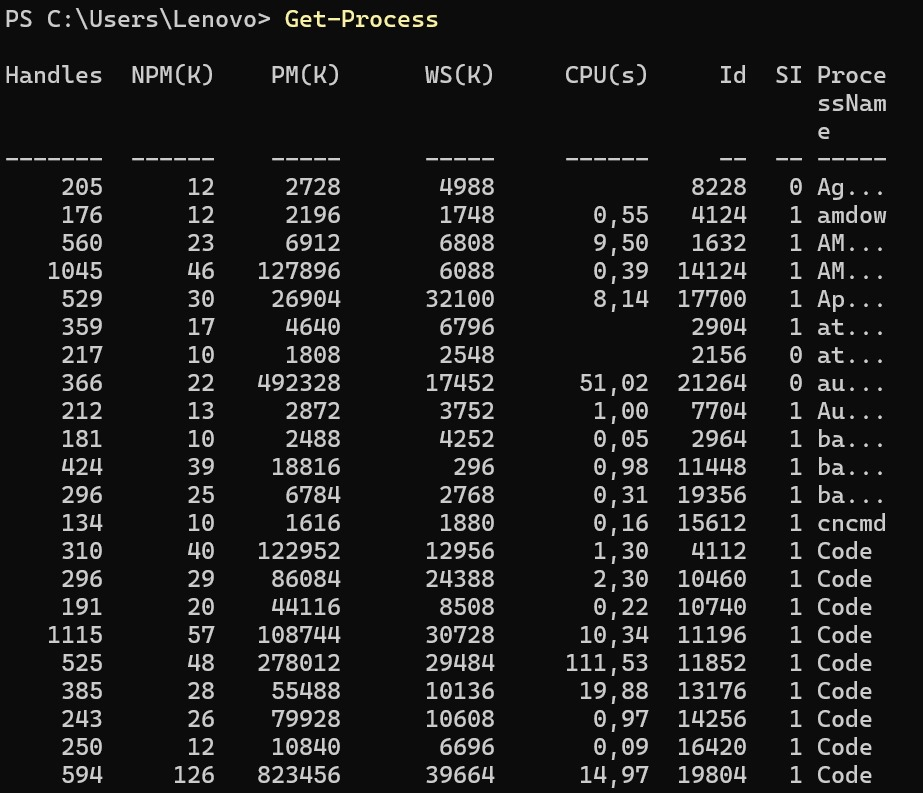

# Tarea 3

Esta práctica tiene como objetivo aprender a usar comandos básicos de **PowerShell** en Windows, similares a los que se usan en Linux.

---

## 1. Ir al directorio personal

```powershell
cd ~
pwd
```
Captura:
  
## 2. Crear la carpeta principal
```powershell
mkdir Practica_Windows
cd Practica_Windows
```
Captura:
  
## 3. Crear subcarpetas
```powershell
mkdir Documentos, Backup
ls
```
Captura:
  
## 4. Crear y editar archivo
```powershell
cd Documentos
echo "Hola, este es mi primer archivo en Windows" > nota.txt
notepad nota.txt
```
Captura:
  
## 5. Copiar y renombrar
```powershell
Copy-Item nota.txt ..\Backup\
Rename-Item nota.txt nota_final.txt
ls
```
Captura:
  
## 6. Ver contenido
```powershell
Get-Content nota_final.txt
```
Captura:
  
## 7. Cambiar permisos
```powershell
icacls nota_final.txt /inheritance:r /grant $env:USERNAME:R
(Otorgar permisos de lectura/escritura)
icacls nota_final.txt /inheritance:r /grant $env:USERNAME:F
```
Captura:
  
## 8. Buscar archivo en todo el home
```powershell
cd ~
Get-ChildItem -Recurse -Filter "nota_final.txt"
```
Captura:
  
## 9. Filtrar contenido (buscar palabra dentro del archivo)
```powershell
Select-String -Path ~/Practica_Windows/Documentos/nota_final.txt -Pattern "Windows"
```
Captura:
  
## 10 Procesos
Ver procesos:
```powershell
Get-Process
```
Captura:
  
Crear proceso en segundo plano:
```powershell
Start-Process notepad -PassThru
```
Captura:
  
Matar proceso (usar el PID):
```powershell
Stop-Process -Id <PID>
```
Captura:
  
## 11 Instalar y usar un paquete
```powershell
winget install cowsay
cowsay "Ejercicio completado!"
```
Captura:
  
 
## 12 Crear script final
Crear script:

```powershell
cd ~/Practica_Windows
notepad mis_comandos.ps1
```
Captura:

  

Dentro del archivo escribe:

```powershell
New-Item -ItemType Directory -Force -Name Logs
Get-Date | Out-File Logs/fecha.txt
cowsay "Ejercicio completado!"
```
Captura:

  

 
Guardar y cerrar.

Dar permisos de ejecución:

```powershell
Set-ExecutionPolicy RemoteSigned -Scope CurrentUser
```
Captura:
  

Ejecutar:
```powershell
.\mis_comandos.ps1
```
Captura:

  
